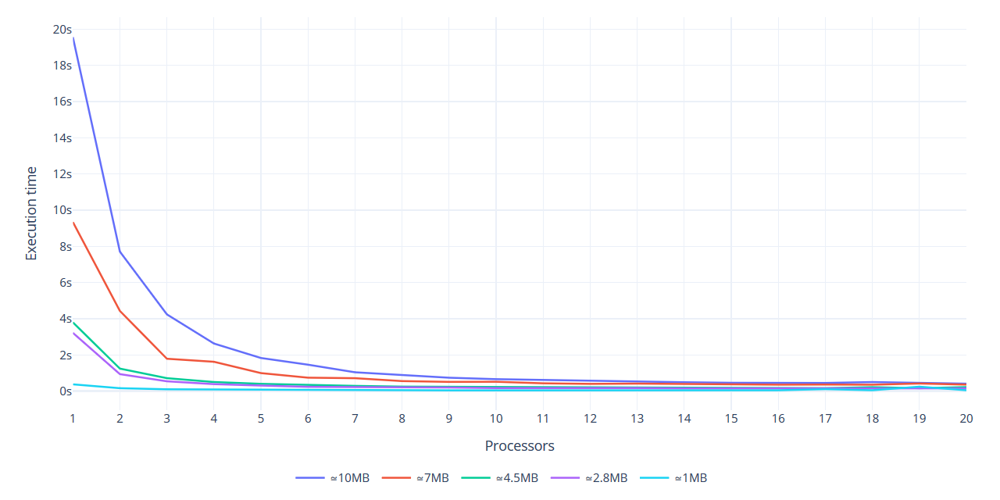

# MPI-WordsCount
This is a simple parallel implementation of words count using Open MPI
developed in the context of Parallel, Concurrent and Cloud programming
course at the University of Salerno. 

## Problem statement
The aim is to make a map-reduce version of words count using MPI in
order to perform word counting over a large number of files.

The process is divided in 3 steps:
* Assign each worker the input files' sections it has to work on
* Count the words occurrences in each section in parallel
* Merge the results obtained by each worker at master process

## Solution approach
Assuming that each worker already has the input files available locally,
the solution presented here also performs the first step of the process
in parallel, meaning that each process determines autonomously which
sections of the input it has to work on, avoiding communicating with
the others.

The first step of the process has been designed to have each process
workload to differ by the length of one word at most: the workloads
distribution algorithm assigns each worker a section of size equal to the
total input size (expressed in bytes) divided by the number of workers
(it adds one more byte to some of the sections if the remainder of the
division isn't zero). Each worker knows which files it has to work on
and for each of them what byte to start reading and which one to stop
at: the counting algorithm here figures out if the starting byte is in
the middle of a word and, if so, skips the entire word, and counts the
following words up to the end of the section (and beyond if the last
byte is in the middle of a word).

The words count are stored inside a hash table to reduce the search
time whenever a word count has to be updated. This table is local to
each process and it is updated every time a new word is read.
At the end of this phase, each worker then communicates the content of
the hash table to the master process which will merge them into his own
local hash table and log the results.

## Implementation details
This project uses CMake (minimum version 3.5) to manage the builds and
depends on OpenSSL (minimum version 1.0.2) for SHA-1 functions as
well as on Open MPI.

Due to the different definition of word among the various languages,
here a word is considered as a sequence of alphanumeric symbols, thus
"can't", for example, ends up being split in two words. This definition
can be changed by editing the [parsing function](src/counter.c).

Hash tables are used to store the input details for each worker as well
as to keep track of the words count, as mentioned above. Linked lists
and dynamic memory allocation have been chosen over array resizing
in the trade-off between performance and memory usage.

This solution has been developed using various MPI communication
routines such as `Isend` and `Gather`, besides the more common `Send`
and `Recv`. Timestamps have been taken using `Wtime`.

Data types have also been defined using `MPI_Type_create_struct` in
order to send structures without packing/unpacking manually
([anyway one of these ended up not being used](https://github.com/NelloCarotenuto/MPI-WordsCount/commit/625ca6f791425d2fc229c1dbf6670390ea7d3038)). This didn't
solve the problem of sending non-contiguous data though, so
memory-to-memory copy operations are still needed when sending a linked
list over to another node (`MPI_Type_create_hindexed_block` didn't fit
as well).

## Benchmarking
The solution has been tested over (up to) 5 AWS EC2 t2.xlarge instances
using the files inside the [data](data/) folder as input. These books
have been downloaded from [Project Gutenberg](https://www.gutenberg.org/)
so please refer to their terms and conditions if you wish to use them as
well.

The performance have been evaluated in terms of strong and weak
scalability, which means using an increasing number of processors over a
fixed input and using an increasing number of processors with the
load-per-processor fixed respectively.

### Strong scalability


Strong scalability tests show that the executions times are
significantly lower as the number of processes are used, when the input
size is big enough. As shown in the graph, using 20 processors and the
input sizes listed above, the communication overhead doesn't impact the
performance leading to assume that more processors or lower input sizes
are needed to find the point after which the efficiency goes down.

From the graph it is also possible to notice that the performance doesn't
really improve when using 15 to 20 processors, meaning that for input
sizes similar to those used to run these tests it might be pointless to
use more than 15 processors (which instead could become very helpful
when much bigger problems are to be solved).

Overall, execution times (which have been calculated three times for
each input size and plotted as a mean of these results) are up to
47-times lower (with the biggest input) and the strong scaling
efficiency ranges from 87% up to 240% with results getting better as the
input size is increased.

### Weak scalability


Weak scalability tests have been conducted over multiple runs, using
various input sizes for the workers (which of course was the same for
each worker inside the same run).

The results show a very good behaviour when each worker is assigned a
_big_ input size. The weak scaling efficiency goes from 45% registered
with the smallest per-worker input size up to 87% registered in the test
with the biggest per-worker input size (the one represented with a purple
line in the above graph is to be considered unreliable).

Overall, execution times seem not to vary too much, implying that this
solution should be able to solve larger problems in an acceptable amount
of time by using more resources.

## Replication
To replicate the tests, make sure Open MPI, OpenSSL (`libssl-dev`) and
CMake are installed, hostsfile is available and then perform the
following:

```
$ git clone https://github.com/NelloCarotenuto/MPI-WordsCount.git
$ cd MPI-WordsCount
$ mkdir build
$ cd build
$ cmake ..
$ make
$ mv MPI-WordsCount ..
$ cd ..
$ ./scripts/scpfiles.sh --hosfile <hostsfile> --user <user>
```

### Manual tests
You can then run the executable using X processors on a list of files
passed as arguments as follows:

```
$ mpirun -np X --hostfile <hostsfile> MPI-WordsCount -f <filenames>
```

It is also possible to run the executable with X processors on every
regular file inside a directory as follows:
```
$ mpirun -np X --hostfile <hostsfile> MPI-WordsCount -d <dirname>
```

Another option available is to run it with X processors over a the files
specified in a master file containing their relative paths as follows:
```
$ mpirun -np X --hostfile <hostsfile> MPI-WordsCount -mf <masterfile>
```

### Automated tests
The [scripts folder](scripts/) also contains two scripts to automate
strong and weak scalability tests using one to X processors over inputs
of choice.

For strong scalability tests, all of the options listed above are
available, so each of these will work:

```
$ ./scripts/runsstests.sh MPI-WordsCount --maxnp X --hostfile <hostfile> -f <filenames>
$ ./scripts/runsstests.sh MPI-WordsCount --maxnp X --hostfile <hostfile> -d <dirname>
$ ./scripts/runsstests.sh MPI-WordsCount --maxnp X --hostfile <hostfile> -mf <masterfile>
```

For weak scalability tests, you can specify one or more files _each_
worker will be assigned and the syntax is the following:

```
$ ./scripts/runwstests.sh MPI-WordsCount --maxnp X --hostfile <hostsfile> -f <filenames>
```
