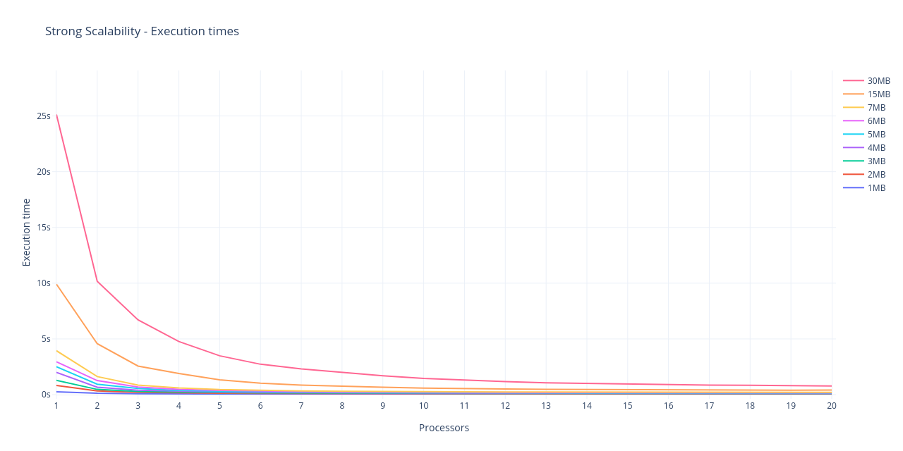
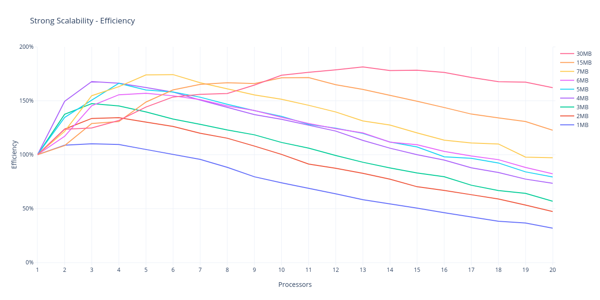
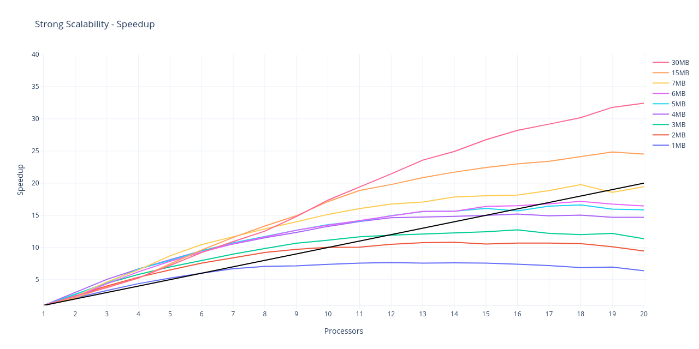
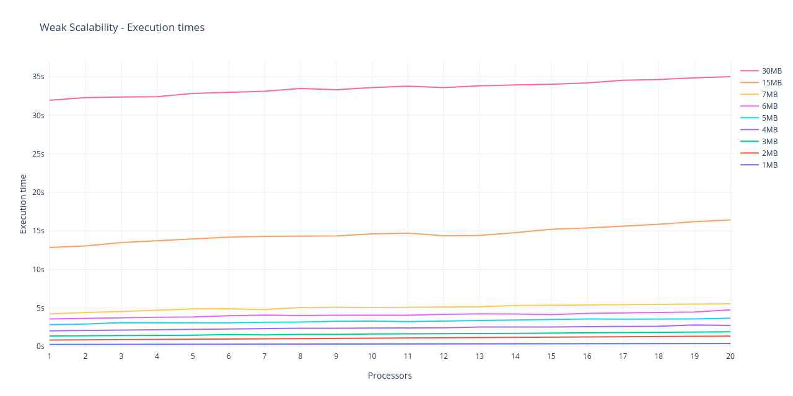
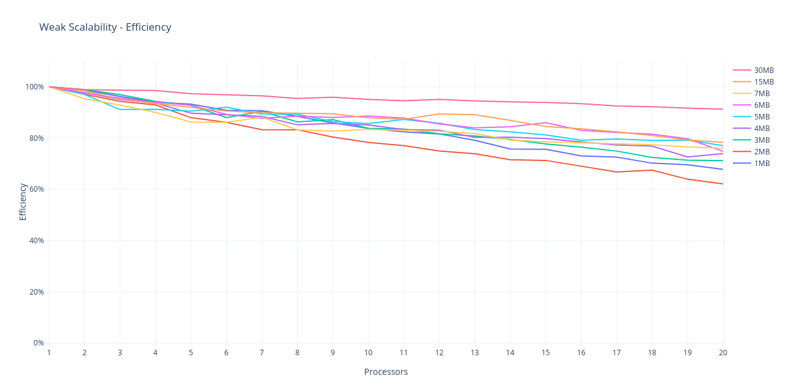

# MPI-WordsCount
This is a simple parallel implementation of words count using Open MPI
developed in the context of Parallel, Concurrent and Cloud programming
course at the University of Salerno. 

## Problem statement
The aim is to make a map-reduce version of words count using MPI in
order to perform word counting over a large number of files.

The process is divided in 3 steps:
* Assign each worker the input files' sections it has to work on
* Count the words occurrences in each section in parallel
* Merge the results obtained by each worker at master process

## Solution approach
Assuming that each worker already has the input files available locally,
the solution presented here also performs the first step of the process
in parallel, meaning that each process determines autonomously which
sections of the input it has to work on, avoiding communicating with
the others.

The first step of the process has been designed to have each process
workload to differ by the length of one word at most: the workloads
distribution algorithm assigns each worker a section of size equal to the
total input size (expressed in bytes) divided by the number of workers
(it adds one more byte to some of the sections if the remainder of the
division isn't zero). Each worker knows which files it has to work on
and for each of them what byte to start reading and which one to stop
at: the counting algorithm here figures out if the starting byte is in
the middle of a word and, if so, skips the entire word, and counts the
following words up to the end of the section (and beyond if the last
byte is in the middle of a word).

The words count are stored inside a hash table to reduce the search
time whenever a word count has to be updated. This table is local to
each process and it is updated every time a new word is read.
At the end of this phase, each worker then communicates the content of
the hash table to the master process which will merge them into his own
local hash table and log the results.

## Implementation details
This project uses CMake (minimum version 3.5) to manage the builds and
obviously depends on Open MPI.

Due to the different definition of word among the various languages,
here a word is considered as a sequence of alphanumeric symbols, thus
"can't", for example, ends up being split in two words. This definition
can be changed by editing the [parsing function](src/counter.c).

Hash tables are used to store the input details for each worker as well
as to keep track of the words count, as mentioned above. Linked lists
and dynamic memory allocation have been chosen over array resizing
in the trade-off between performance and memory usage in order to make
solving bigger problems possible. In fact, if word counts are kept in
dynamic arrays, the system may not find the requested contiguous memory
chunks for each list when they become too big. Using linked lists allows
instead to pack data into contiguous memory chucks (with memory-to-memory
copies) only when a list has to be sent.

This solution has been developed using various MPI communication
routines such as `Isend` and `Gather`, besides the more common `Send`
and `Recv`. Timestamps have been taken using `Wtime`.

Data types have also been defined using `MPI_Type_create_struct` in
order to send structures without packing/unpacking manually
([anyway one of these structures ended up not being used](https://github.com/NelloCarotenuto/MPI-WordsCount/commit/625ca6f791425d2fc229c1dbf6670390ea7d3038)).
This didn't solve the problem of sending non-contiguous data though, so
memory-to-memory copy operations are still needed when sending a linked
list over to another node (`MPI_Type_create_hindexed_block` didn't help
either).

The results of the computation are printed on standard output in a table
reporting each word with its associated count. A full report is also
generated in a folder named `reports/` (which is automatically created by
the program if it doesn't exist) and it also includes details about
workload partitioning among processors. A (partial) example of report is
the following:

```
Execution info
----------------------------------------------------------------------------------------------------------------
Date of the test                                                                             2019-06-03 08:24:49
Number of workers                                                                                              3
Number of lists in the hash table                                                                            128
Number of words                                                                                           263420
Number of bytes                                                                                          4419779
----------------------------------------------------------------------------------------------------------------

Execution times
----------------------------------------------------------------------------------------------------------------
Worker  0                                                                                              0.716066s
Worker  1                                                                                              0.716445s
Worker  2                                                                                              0.716956s
----------------------------------------------------------------------------------------------------------------

Workload distribution
----------------------------------------------------------------------------------------------------------------
Worker File                                                                                       Start      End
----------------------------------------------------------------------------------------------------------------
     0 data/War and peace                                                                             0  1473260
     1 data/War and peace                                                                       1473260  2946520
     2 data/The Iliad                                                                                 0  1152276
     2 data/War and peace                                                                       2946520  3267503
----------------------------------------------------------------------------------------------------------------

Results
----------------------------------------------------------------------------------------------------------------
Word                                                                                                 Occurrences
----------------------------------------------------------------------------------------------------------------
strauss                                                                                                        1
qualification                                                                                                  1
nestor                                                                                                        98
ionic                                                                                                          1
inspiriting                                                                                                    1
parallels                                                                                                      2
pursuance                                                                                                      3
juno                                                                                                          77
avenging                                                                                                      17
...
```


## Benchmarking
The solution has been tested over (up to) 5 AWS EC2 t2.xlarge Ubuntu 
instances using the files inside the [data](data/) folder as input.
These books have been downloaded from [Project Gutenberg](https://www.gutenberg.org/)
so please refer to their terms and conditions if you wish to use them in
your projects as well.

The performance have been evaluated in terms of strong and weak
scalability, which means using an increasing number of processors over a
fixed input and using an increasing number of processors with the
load-per-processor fixed respectively.

Tests have been executed 25 times for each possible input size/number of
processors combination, both in strong and weak scalability for a total
amount of 1000 executions. The results below are plotted as a mean of
the execution times gathered.

### Strong scalability


Strong scalability tests show that execution times are significantly
lower as the number of processors used is increased. The behavior is
better as the input size is increased, registering a 32-times cut of the
execution time with 20 processors over 30MB of input.



From the efficiency graph it can observed that the communication
overhead has a much bigger impact when lower input sizes are used while
it seems not to impact the performances over the biggest inputs.

The sweet spot tends to move to the right as the size of the input is
increased, meaning that the bigger is the input, the larger the number of
processors should be to reach higher efficiency.

With a 30MB input the efficiency stays high with any number of processors,
registering a remarkable peak of 181% with a low of just 123%.



The (relative) speedup shows once more how good the performances are as the input
size is increased. The super-linear behavior is likely to come from the
less frequent memory accesses when more processors share the same chip
([more details here](https://stackoverflow.com/questions/4332967/where-does-super-linear-speedup-come-from))
but also by poor performances of the parallel algorithm when called
with a single processor (execution times of purely sequential programs
implemented didn't achieve much better performances though, this is why
the parallel algorithm is used as a reference for the sequential execution).

### Weak scalability


Weak scalability tests show a good behavior by the algorithm. Overall,
execution times seem not to vary too much over the per-processor input
sizes listed above, implying that this solution should be able to solve
larger problems in an acceptable amount of time by using more resources.



The results show a very good behavior when each worker is assigned a
bigger workload. The weak scaling efficiency for 20 processors goes
from 62% registered with one of the smallest per-worker input size up to
91% registered in the test with the biggest per-worker input size.

## Replication
To replicate the tests, make sure Open MPI and CMake are installed,
hosts file is available and then perform the following:

```
$ git clone https://github.com/NelloCarotenuto/MPI-WordsCount.git
$ cd MPI-WordsCount
$ mkdir build
$ cd build
$ cmake ..
$ make
$ mv MPI-WordsCount ..
$ cd ..
$ ./scripts/scpfiles.sh --hostfile <hostfile> --user <user>
```

### Manual tests
You can then run the executable using X processors on a list of files
passed as arguments as follows:

```
$ mpirun -np X --hostfile <hostsfile> MPI-WordsCount -f <filenames>
```

It is also possible to run the executable with X processors on every
regular file inside a directory as follows:
```
$ mpirun -np X --hostfile <hostsfile> MPI-WordsCount -d <dirname>
```

Another option available is to run it with X processors over a the files
specified in a master file containing their relative paths as follows:
```
$ mpirun -np X --hostfile <hostfile> MPI-WordsCount -mf <masterfile>
```

### Automated tests
The [scripts folder](scripts/) also contains two scripts to automate
strong and weak scalability tests using one to X processors over inputs
of choice and repeat the test multiple times for each value of X.

These scripts will create a `performances/` folder in which execution
times of each set of tests will be reported in a .CSV file.

For strong scalability tests, all of the options listed above are
available, so each of these will work:

```
$ ./scripts/runsstests.sh --maxnp X --hostfile <hostfile> --runs <runs> MPI-WordsCount -f <filenames>
$ ./scripts/runsstests.sh --maxnp X --hostfile <hostfile> --runs <runs> MPI-WordsCount -d <dirname>
$ ./scripts/runsstests.sh --maxnp X --hostfile <hostfile> --runs <runs> MPI-WordsCount -mf <masterfile>
```

For weak scalability tests, you can specify one or more files _each_
worker will be assigned and the syntax is the following:

```
$ ./scripts/runwstests.sh --maxnp X --hostfile <hostfile> --runs <runs> MPI-WordsCount -f <filenames>
```
